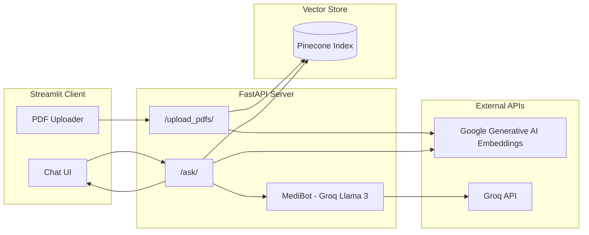

# RAG Medical AI Assistant

An AI-powered medical document assistant that lets you upload PDF health records, research papers, or clinical notes and ask questions in natural language. Answers are generated using **Retrieval-Augmented Generation (RAG)** — the model responds only from content retrieved from your uploaded documents, not from general medical knowledge alone.

> **Disclaimer:** This project is for educational and informational purposes only. It does **not** provide medical advice, diagnoses, or treatment recommendations. Always consult a qualified healthcare professional for medical decisions.

---

## Features

- **PDF document upload** — Upload one or more medical PDFs through a Streamlit sidebar
- **Semantic search** — Questions are embedded and matched against document chunks stored in Pinecone
- **Grounded answers** — Responses are generated by **MediBot** (Llama 3 70B via Groq) using only retrieved context
- **Chat interface** — Streamlit chat UI with session-based conversation history
- **Chat export** — Download your conversation as a plain-text file
- **REST API** — FastAPI backend with dedicated upload and question endpoints
- **Structured logging** — Server-side logging via Loguru for debugging and monitoring

---

## Architecture



### How it works

1. **Upload** — PDFs are saved locally, split into 500-character chunks (50-character overlap), embedded with Google `embedding-001`, and upserted into a Pinecone index.
2. **Ask** — The user's question is embedded, Pinecone returns the top 3 most similar chunks, and those chunks are passed as context to the LLM.
3. **Respond** — MediBot generates an answer strictly from the retrieved context. If no relevant information is found, it says so explicitly.

---

## Tech Stack

| Layer | Technology |
|-------|------------|
| Frontend | [Streamlit](https://streamlit.io/) |
| Backend | [FastAPI](https://fastapi.tiangolo.com/) + [Uvicorn](https://www.uvicorn.org/) |
| LLM | [Groq](https://groq.com/) — `llama3-70b-8192` |
| Embeddings | [Google Generative AI](https://ai.google.dev/) — `models/embedding-001` |
| Vector database | [Pinecone](https://www.pinecone.io/) (serverless, AWS `us-east-1`) |
| RAG framework | [LangChain](https://python.langchain.com/) |
| PDF parsing | PyPDF via LangChain `PyPDFLoader` |
| Python | 3.13+ |

---

## Project Structure

```
medical_assisstant/
├── client/                     # Streamlit frontend
│   ├── app.py                  # Main Streamlit entry point
│   ├── config.py               # Backend API URL configuration
│   ├── requirements.txt
│   ├── components/
│   │   ├── chatUI.py           # Chat interface and message handling
│   │   ├── upload.py           # PDF upload sidebar
│   │   └── history_download.py # Chat history export
│   └── utils/
│       └── api.py              # HTTP client for FastAPI endpoints
│
├── server/                     # FastAPI backend
│   ├── main.py                 # App initialization, CORS, route registration
│   ├── logger.py               # Loguru logging setup
│   ├── requirements.txt
│   ├── routes/
│   │   ├── upload_pdfs.py      # POST /upload_pdfs/
│   │   └── ask_question.py     # POST /ask/
│   ├── modules/
│   │   ├── load_vectorstore.py # PDF ingestion, chunking, Pinecone upsert
│   │   ├── pdf_handlers.py     # File save utilities
│   │   ├── llm.py              # Groq LLM + MediBot prompt + RetrievalQA chain
│   │   └── query_handlers.py   # Chain invocation and response formatting
│   └── middlewares/
│       └── exception_handlers.py
│
├── pyproject.toml
├── .python-version             # Python 3.13
└── .gitignore
```

---

## Prerequisites

Before running the project, you will need:

1. **Python 3.13+** (see `.python-version`)
2. API keys for:
   - [Groq](https://console.groq.com/) — LLM inference
   - [Google AI Studio](https://aistudio.google.com/) — text embeddings
   - [Pinecone](https://app.pinecone.io/) — vector storage
3. A Pinecone account with serverless index support (the app creates the index automatically if it does not exist)

---

## Environment Variables

Create a `.env` file in the **`server/`** directory (or project root — both are loaded via `python-dotenv`):

```env
# Groq — powers the MediBot LLM
GROQ_API_KEY=your_groq_api_key

# Google Generative AI — powers document & query embeddings
GOOGLE_API_KEY=your_google_api_key

# Pinecone — vector store
PINECONE_API_KEY=your_pinecone_api_key
PINECONE_INDEX_NAME=medicalindex
```

| Variable | Required | Description |
|----------|----------|-------------|
| `GROQ_API_KEY` | Yes | API key for Groq ChatGroq LLM |
| `GOOGLE_API_KEY` | Yes | API key for Google Generative AI embeddings |
| `PINECONE_API_KEY` | Yes | Pinecone project API key |
| `PINECONE_INDEX_NAME` | Yes | Pinecone index name (default used in code: `medicalindex`) |

> **Note:** The upload module creates a Pinecone index named `medicalindex` with 768 dimensions and dot-product metric if it does not already exist. Ensure `PINECONE_INDEX_NAME` in your `.env` matches this name when querying.

---

## Installation

### 1. Clone the repository

```bash
git clone https://github.com/hansikadev/RAG-Medical-AI-Assistant.git
cd RAG-Medical-AI-Assistant
```

### 2. Set up the backend

```bash
cd server
python -m venv .venv

# Windows
.venv\Scripts\activate

# macOS / Linux
source .venv/bin/activate

pip install -r requirements.txt
```

Add your `.env` file with the required API keys (see above).

### 3. Set up the frontend

Open a new terminal:

```bash
cd client
python -m venv .venv

# Windows
.venv\Scripts\activate

# macOS / Linux
source .venv/bin/activate

pip install -r requirements.txt
```

The client connects to the backend at `http://127.0.0.1:8000` by default (configured in `client/config.py`).

---

## Running the Application

You need **both** the server and client running at the same time.

### Start the FastAPI server

```bash
cd server
uvicorn main:app --reload --host 127.0.0.1 --port 8000
```

API docs are available at:
- Swagger UI: [http://127.0.0.1:8000/docs](http://127.0.0.1:8000/docs)
- ReDoc: [http://127.0.0.1:8000/redoc](http://127.0.0.1:8000/redoc)

### Start the Streamlit client

In a separate terminal:

```bash
cd client
streamlit run app.py
```

The app opens in your browser (typically [http://localhost:8501](http://localhost:8501)).

---

## Usage

1. **Upload documents** — Use the sidebar to select one or more PDF files, then click **Upload DB**. Wait for the success message while chunks are embedded and stored in Pinecone.
2. **Ask questions** — Type a question in the chat input, e.g. *"What medications are listed in the report?"* or *"Summarize the patient's diagnosis."*
3. **Review answers** — MediBot responds based on retrieved document context. Answers are factual and will decline to speculate beyond the uploaded content.
4. **Download history** — Use **Download Chat History** to save the conversation as `chat_history.txt`.

---

## API Reference

### `POST /upload_pdfs/`

Upload one or more PDF files for ingestion into the vector store.

**Request:** `multipart/form-data` with field `files` (one or more PDF files)

**Success response (200):**
```json
{
  "messages": "Files processed and vectorstore updated"
}
```

**Error response (500):**
```json
{
  "error": "Error description"
}
```

---

### `POST /ask/`

Ask a question against the indexed documents.

**Request:** `application/x-www-form-urlencoded`

| Field | Type | Description |
|-------|------|-------------|
| `question` | string | The user's natural-language question |

**Success response (200):**
```json
{
  "response": "Answer grounded in retrieved document context.",
  "sources": ["source metadata from matched chunks"]
}
```

**Error response (500):**
```json
{
  "error": "Error description"
}
```

---

## Example cURL Requests

**Upload PDFs:**
```bash
curl -X POST "http://127.0.0.1:8000/upload_pdfs/" \
  -F "files=@report.pdf" \
  -F "files=@lab_results.pdf"
```

**Ask a question:**
```bash
curl -X POST "http://127.0.0.1:8000/ask/" \
  -d "question=What are the main findings in the uploaded report?"
```

---

## Configuration

| Setting | Location | Default |
|---------|----------|---------|
| Backend URL | `client/config.py` | `http://127.0.0.1:8000` |
| LLM model | `server/modules/llm.py` | `llama3-70b-8192` |
| Embedding model | `server/modules/load_vectorstore.py` | `models/embedding-001` |
| Chunk size / overlap | `server/modules/load_vectorstore.py` | 500 / 50 |
| Top-K retrieval | `server/routes/ask_question.py` | 3 |
| Upload directory | `server/modules/load_vectorstore.py` | `./uploaded_docs` |
| Pinecone region | `server/modules/load_vectorstore.py` | `us-east-1` (AWS) |

---

## Troubleshooting

| Issue | Possible cause | Fix |
|-------|----------------|-----|
| `PINECONE_API_KEY` error on ask | Missing or wrong env var | Add keys to `.env` and restart the server |
| Empty or irrelevant answers | No documents uploaded yet | Upload PDFs first via the sidebar |
| Connection refused from Streamlit | Backend not running | Start Uvicorn on port 8000 |
| Pinecone index dimension mismatch | Existing index with wrong dimensions | Delete the old index or use a new index name (768 dims required) |
| Upload succeeds but query fails | Index name mismatch | Set `PINECONE_INDEX_NAME=medicalindex` in `.env` |

---

## Roadmap

- [ ] Surface source document citations in the chat UI
- [ ] Support additional file formats (DOCX, TXT)
- [ ] User authentication and per-user document isolation
- [ ] Docker Compose setup for one-command deployment
- [ ] Automated tests for upload and query flows

---

## Contributing

Contributions are welcome. To get started:

1. Fork the repository
2. Create a feature branch (`git checkout -b feature/your-feature`)
3. Commit your changes
4. Open a pull request against `main`

---

## License

This project is open source. Add a license file (e.g. MIT) if you plan to distribute it publicly.

---

## Author

Built by [hansikadev](https://github.com/hansikadev)

Repository: [RAG-Medical-AI-Assistant](https://github.com/hansikadev/RAG-Medical-AI-Assistant)
